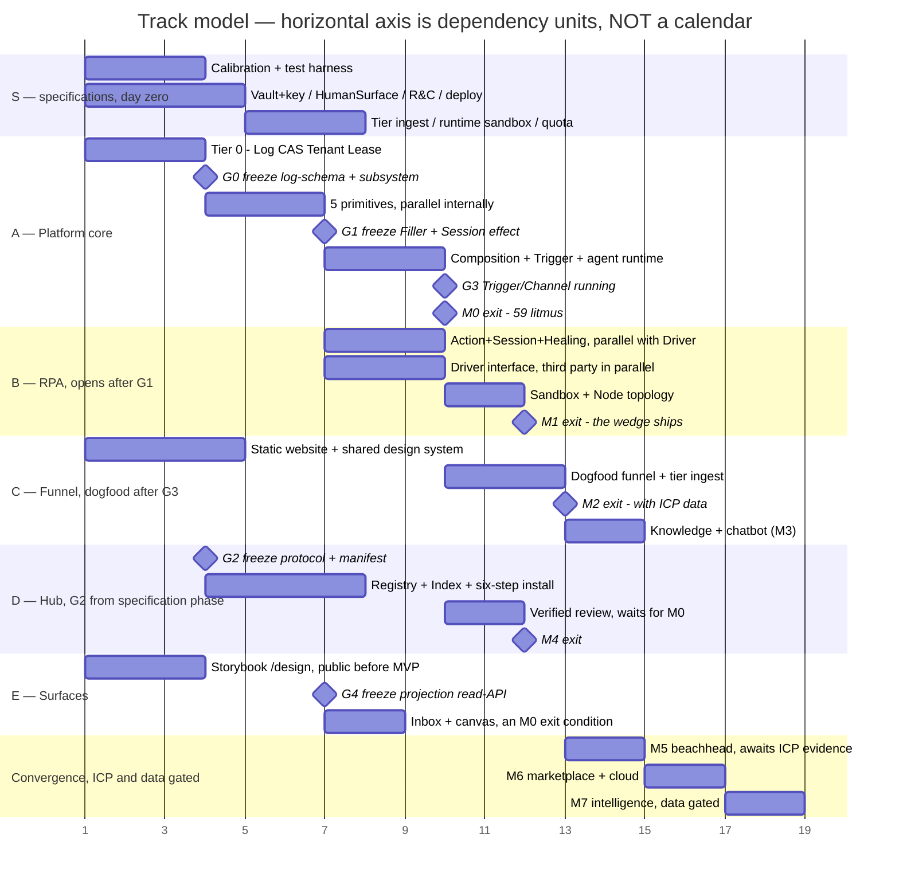

# Roadmap

> **A living document**, like the market ledger: it changes with evidence rather
> than at a freeze. The ban on staging language applies to the ceiling — **this
> file is allowed** to speak of phases, milestones and versions.
>
> The supreme rule, inherited from the North Star: **a slice may only narrow
> value or policy, never a mechanism.** A milestone enables a cluster of
> mechanism **completely** or not at all. Temporary half-mechanisms are
> absolutely forbidden — auto-pass on timeout, a lock without a TTL, a
> self-writing table beside the log, a separate code path for standalone.
>
> **An assumption stated outright**: there is no velocity data at all, so **there
> are no dates in this file**. Milestones are ordered by _what is feasible_ ×
> _what is worth doing_, and exit by **measurable litmus** rather than by a
> calendar. Dates arrive here if and only if two milestones have actually run and
> velocity can be inferred.
>
> **Publishing is cut per section** — §3b and §5 are withheld entirely: the
> ICP-gated thresholds are the market ledger in disguise, and the technical
> ledger is a dated map of the system's weak points. The full table is the
> publishing policy in the index.

---

## 0. This roadmap is the SOURCE OF TRUTH; a Projects board is a PROJECTION

A GitHub Projects board will be used. Without declaring the boundary immediately,
the board becomes **a second source of truth about ordering** — an E5 violation
at the process layer. The boundary, in one sentence, in the same shape as
DataTable's "SQL to ask, events to write":

> **This file owns _scope · dependency order · exit litmus_. The board owns
> _execution state_.**

| To change this                                                                                                           | Change it here        | Why                                                                                       |
| ------------------------------------------------------------------------------------------------------------------------ | --------------------- | ----------------------------------------------------------------------------------------- |
| Whether an item **exists at all**, which track or milestone it belongs to, which gate blocks it, what its exit litmus is | **Only in this file** | This is a _promise of mechanism_; changing it changes the design and needs reasoning (§7) |
| Which column it is in, who has it, an estimate, a date                                                                   | **Only on the board** | This is _state_, changing daily; writing it here turns this file into a work diary        |

**The two-way law** (group M applied to the board — the same law as §6b):

1. **Every card traces to exactly one id in this file.** A card that traces to
   nothing means the scope was never decided: open a pull request against the
   roadmap first, do not drag the card.
2. **Every id in this file has at least one card** once its track has started. An
   orphan id is a promise nobody is nurturing.

**The id scheme — stable, append-only, never reused** (the same discipline as the
rubric's criterion ids):

```
<Track>.<seq> for example A.3 · B.1 · R.5 · E.2
```

Each id carries: **track · milestone · blocking gate · a pointer to its exit
litmus**. A sequence number is **never reused**, even for a cancelled item —
cancellation marks it rather than deleting it. Otherwise an old card silently
points at a different item.

**The id registry is §6b's table, not a separate one.** §6b is already the one
place where two-way completeness holds (litmus #10: every mechanism cluster has
exactly one cell), so putting the ids there makes "every id has a home" and
"every cluster has an id" **the same** property rather than two tables to keep in
step. A row that only _points_ at another rather than carrying work takes `—` in
the ID column and says where it points — issuing an id to a covering row creates
a promise nobody is nurturing (two-way law #2).

**Board fields must be DERIVED, never copied** (the _derive → configure →
hardcode_ ladder):

| Board field                      | Derived from                                    | Existing gate                     |
| -------------------------------- | ----------------------------------------------- | --------------------------------- |
| **Area**                         | The frontmatter of each subsystem's root README | `dev-cli check-subsystem-readmes` |
| **Milestone** (GitHub Milestone) | M0–M7 of §4, **1:1**                            |                                   |
| **Gate**                         | ◆G0–◆G4 of §1b                                  |                                   |
| **Track**                        | A · B · C · D · E · S · **R** of §1b            |                                   |
| **Roadmap ID**                   | The ID column of §6b                            | `dev-cli check-roadmap-ids`       |

**Forbidden**: a free-text "Priority" field on the board. What is worth doing
first is already §2, and the unlock conditions are already §3b; a hand-typed
priority column is **a third source** and it will beat both, because it is the
nearest to hand.

## 1. Axis one — the dependency graph, topologically sorted from 27 specifications

```
TIER 0 (nothing beneath it — sources of truth and identity)
 Event Log ── Artifact Store ── Tenant & Identity (core) ── Lease
 │ │ │
TIER 1 (five primitives, plus assembly) │
 Role ── Task ── Checkpoint ── Handoff ── Escalation
 └──────── Composition (static analysis) ────────┘
 │
 Trigger & Channel (the doors in and out)
 │
TIER 2 (runtime and modules)
 Agent runtime ── RPA (Action → Session → Driver → Self-healing → Sandbox)
 Working Data (DataTable) ── Knowledge ── Memory
 Hub (Block: pack → sign → OCI → resolve/pull/verify)
 │
TIER 3 Human Surface (inbox) ── Pair-design ── Labor Analytics
 │
TIER 4 Intelligence (runs only once the flywheel has data)
```

**Three non-obvious topological constraints**, which fall out of reading the
specifications rather than out of intuition:

| Constraint                                                        | Why                                                                                                                                                                                      | Scheduling consequence                                                                                                                      |
| ----------------------------------------------------------------- | ---------------------------------------------------------------------------------------------------------------------------------------------------------------------------------------- | ------------------------------------------------------------------------------------------------------------------------------------------- |
| **The Hub does NOT block the Platform**                           | The cascade's `template` level is the set of installed blocks, and the cascade still resolves through `tenant → process → role → task` when a tenant has installed none (Composition §3) | The Hub can be deferred without narrowing a mechanism                                                                                       |
| **RPA needs exactly two interfaces, not the whole Platform**      | RPA principle #5: standalone is a _projection_ of integration, with a minimal internal consumer standing in for the Platform                                                             | RPA runs in parallel once the **Filler interface and Session effect are frozen** — but may not start before, or it grows a second code path |
| **Calibration is a condition of litmus #3, not a tier-5 feature** | "One confidence scale for people and AI" is Checkpoint's layer C plus Role graduation; without the calibration specification, M0 **cannot exit**                                         | The calibration data model must be written **inside** M0, not "in a later round"                                                            |

## 1b. The track model — parallelism for a team of more than one

**The principle**: the chain M0 → M7 in §4 is _a topological sort for one line of
execution_. It is correct for one person and hides the parallelism available to
N. The real synchronisation point between tracks is **not "the previous milestone
finished"** but **an INTERFACE FREEZE** — the same logic as the system's own
protocol-version handshake (North Star §8): two sides need only agree on the
_interface_, never wait for each other to _finish_.

**The gates:**

| ◆ Gate | Freezes what                                                                                                                 | Opens which track or branch                                                                                                                             | Cost of changing it after the freeze                                     |
| ------ | ---------------------------------------------------------------------------------------------------------------------------- | ------------------------------------------------------------------------------------------------------------------------------------------------------- | ------------------------------------------------------------------------ |
| **G0** | The Event Log entry schema plus the subsystem interfaces (CAS `put/get/exists/delete`, Lease, Principal identity)            | The five primitives in parallel with each other, plus the module foundation — DataTable, Knowledge and Memory are projections or artifacts over the log | **Highest** — every branch consumes it; a change is breaking system-wide |
| **G1** | The Filler interface plus the Session effect                                                                                 | Track B (RPA), and any external agent runtime                                                                                                           | High — two domains                                                       |
| **G2** | `resolve/pull/verify` plus the manifest schema — **a text**, freezable from the specification phase without waiting for code | Track D (the Hub registry and index); the verified-review loop still waits for M0                                                                       | Medium — the Hub plus two clients                                        |
| **G3** | Trigger, Channel, Party and external filler **actually running** — the only runnable gate rather than a text freeze          | Track C (the dogfood funnel)                                                                                                                            | Low — one track                                                          |
| **G4** | The projection read-API — inbox, canvas and dashboard **read a projection and call the engine API**, nothing more            | Track E: the Human Surface inbox and the pair-design canvas                                                                                             | Medium — every surface                                                   |

**The tracks:**

| Track                          | Contents                                                                                                                                                                                                                                                        | Entry gate                                                                          | Convergence                                    |
| ------------------------------ | --------------------------------------------------------------------------------------------------------------------------------------------------------------------------------------------------------------------------------------------------------------- | ----------------------------------------------------------------------------------- | ---------------------------------------------- |
| **S — writing specifications** | Calibration · **the test harness, which feeds the conformance suite of EVERY gate** · Human Surface · Vault and keys · Release & Compatibility · the deploy charter · the clickstream ingest tier · the runtime sandbox · quota and scheduling, and later cloud | Day zero, fully parallel; each specification takes a cluster run (R12)              | §5                                             |
| **A — Platform core**          | Tier 0 → **◆G0** → the five primitives, parallel among themselves → Composition and static analysis → Trigger → the agent runtime                                                                                                                               | Day zero                                                                            | **M0**                                         |
| **B — RPA**                    | Action, Session and Healing ∥ Driver (an Apache-licensed interface, so a third party can write one in parallel) ∥ Sandbox and the Vault consumer; then Node topology; **the attended UI layer**, doing _in-session confirmation only_, never an approval queue  | **◆G1** — **a single gate**                                                         | **M1**                                         |
| **R — Repo & harness**         | The repository foundation, toolchain, gates, skills, the site shell, and migrating the doctrine tree                                                                                                                                                            | Day zero, fully parallel; the release-train lock must land **before the first app** | **M0** for the harness                         |
| **C — Funnel**                 | The static website and charter at any time; dogfooding after **◆G3**                                                                                                                                                                                            | ◆G3                                                                                 | **M2** → M3                                    |
| **D — Hub**                    | Registry, index, pack, signing and the six-step install, from **◆G2 at specification phase**; verified review waits for M0                                                                                                                                      | ◆G2                                                                                 | **M4**                                         |
| **E — Surfaces**               | The `shared/` design system and the `/design` Storybook from **day zero** — the charter allows publishing before MVP and it depends on no engine; inbox and canvas after **◆G4**                                                                                | Day zero, then ◆G4                                                                  | M0, where a minimal inbox is an exit condition |

**The laws of the track model**, which keep every prohibition in §4 intact:

1. **A freeze is an event with provenance.** Changing a frozen interface is
   breaking and takes the major-plus-deprecation route like any protocol (North
   Star §8). The cost of changing an interface after freezing is _multiplied by
   the number of tracks_ — that is the price of parallelism, declared openly.
2. **Exit litmus is still measured at the milestone**, the convergence point.
   Parallel tracks may not "pass gradually, in parts".
3. **Parallelism is not a licence to grow a separate code path.** Track B emits
   effects through exactly the frozen interface from the first day (RPA principle
   #5); Track C only _calls_ the public API; Track D never touches the runtime.
4. **One person is a valid degenerate case**: run the tracks sequentially along
   §4's chain. The track model does not force parallelism; it declares _where
   parallelism is permitted_.
5. **Track B keeps ONE gate: ◆G1.** The temptation is to give it two, because
   ADR-0005 conflated two different things under the phrase "the takeover/approve
   frame":

| The two things conflated                                                                                                               | What each is                                             | Its path                                                    | Gate    |
| -------------------------------------------------------------------------------------------------------------------------------------- | -------------------------------------------------------- | ----------------------------------------------------------- | ------- |
| **In-session confirmation, attended** — a person **sitting at that machine**, watching the takeover, permitting an Action about to run | **Local session control** — the RPA session's Checkpoint | The in-machine channel to the runtime                       | **◆G1** |
| **Approving an Action Item in a queue** — a person **not at that machine**, opening the Work Surface and seeing work waiting           | **A labour surface** — a Work Item or Action Item        | Straight to the engine API, reading the projection read-API | **◆G4** |

**Settled**: M1 does the first and **not** the second. This is **not a narrowing
of value**, as it first appears: the wedge is standalone RPA for a single user,
and that single user **is sitting right there**. An approval queue is a concept
belonging to an organisation of several people, and it belongs to Track E. Cut at
the right joint, M1 **loses nothing**. Two consequences: **ADR-0005 must correct
the phrase**, and RPA North Star §4's second hard boundary stands unchanged —
every **labour** action goes straight to the engine API, and in-session
confirmation is not a labour action but session control.

6. Milestones that are ICP-gated (M5 and M6) **have no track of their own** —
   their gate is market evidence (§3b), not a technical interface.
7. **A gate is a text freeze plus a conformance test suite that runs
   independently.** Two teams reading one frozen interface still implement
   differently — which is exactly R5's _definition_ of major, "two engineers
   reading it would implement differently". A text is not enough; only a test
   suite is an arbiter a machine can check. So passing a gate means passing the
   suite, not having read carefully — and the suite is where the **process test
   harness** first pays for itself. A gate's suite is versioned too: changing the
   suite changes the interface and is breaking.
8. **The limit on parallelism is the number of interfaces that can bear an early
   freeze**, never the number of people. Freezing something unripe multiplies the
   cost of change by the number of consuming tracks — the last column of the gate
   table. Where an interface is doubted, **do not open the track**; accept the
   sequence. Sequential is cheaper than breaking changes spreading.

### 1c. The dependency chart

**A warning about reading it**: the horizontal axis is **abstract dependency
units** — each mermaid "day" is one dependency block — and **is not a calendar**,
because there is no velocity data. A bar's length is its count of internal
dependency blocks, not an effort estimate. Once two milestones have actually run,
the unit is replaced by real days.



## 2. Axis two — the order worth doing, from the market funnel

```
Standalone RPA, free (the wedge: "they come for automation")
 ↓ they came for automation
The platform core plus a funnel running on itself (dogfood #1 — case study #1, and the ICP DATA TAP)
 ↓ they stay for the platform
A support chatbot over the docs (dogfood #2 — a live demo of KB plus chat, and the first customer of the KB-from-git block)
 ↓ there is now content worth distributing
Hub (distribution) → a beachhead pack → Marketplace and Cloud
```

**The point worth stating plainly**: the funnel, dogfood #1, is not "a marketing
page to build later" — it is **the instrument that measures the ICP**. Pushing it
to the end means blindfolding yourself exactly when you most need to see.

## 3. Two zones — cut now, or wait for evidence

### 3a. ICP-independent — correct even if the ICP hypothesis is entirely wrong

| Item                                                        | Why it does not depend on the ICP                                                        |
| ----------------------------------------------------------- | ---------------------------------------------------------------------------------------- |
| Event Log · Artifact Store · Tenant & Identity core · Lease | The source of truth and the ownership boundary: every ICP needs them                     |
| The five primitives, Composition and static analysis        | This is the _definition_ of the product, not a market choice                             |
| Trigger & Channel — webhook, schedule, form, manual, sync   | The minimum door into any scenario                                                       |
| Vault and key lifecycle                                     | The precondition of every deletion and security promise                                  |
| Agent runtime, the Filler interface, the Session effect     | The precondition of symmetry — the heart of the product                                  |
| RPA's five specifications plus Node topology                | The wedge, and the test of those two interfaces                                          |
| A minimal Human Surface — triage, diff, batch review        | Without an inbox nobody can _use_ it, whoever they are                                   |
| Release & Compatibility plus the deploy charter             | Unable to ship means there is no ICP to ask                                              |
| The website funnel (dogfood #1)                             | It is the instrument that measures the ICP, so it must exist **before** the ICP is known |
| The Knowledge module                                        | The precondition of dogfood #2 and of any scenario with domain knowledge                 |

### 3b. ICP-gated — the unlock conditions

Every item that depends on a market hypothesis has an unlock condition pointing
at a measurable kill criterion. **The thresholds are not published**: anyone about
to be interviewed who reads them knows which answer "counts", and the data is
contaminated from the first question. The mechanism is public — a condition must
be measurable and must point at a line that can turn out false — the numbers are
not.

## 4. Milestones — each slice is a rubric milestone

Each milestone declares exactly three things: **(a)** which mechanism it enables
COMPLETELY · **(b)** which value or policy it narrows · **(c)** which temporary
half-mechanism it forbids.

### M0 — A backbone with a ledger _(ICP-independent)_

- **(a) Complete**: Event Log with projection rebuild, timers-as-entries and
  crypto-shredding; Artifact Store; Tenant & Identity core at cardinality 1;
  Lease; Role, Task, Checkpoint, Handoff, Escalation; Composition with static
  analysis; Trigger with **every mechanism of the types enabled** — webhook,
  schedule, manual, form **plus `response_mode: sync`**, the BaaS API endpoint
  that is a secondary wedge for the solo developer, with static analysis
  enforcing the sync path as Trigger §2 requires; and a minimal agent runtime.
  The type `message_in(channel)` moves to M2, which narrows the _type taxonomy_ —
  a value — rather than cutting a mechanism of an enabled type. **Two interfaces
  freeze**: the Filler interface and the Session effect.
- **(b) Narrowed**: one tenant and one invisible workspace · the cascade stops at
  `tenant → process → role → task`, since there is no template level without the
  Hub · no Knowledge, Memory or DataTable module · no enterprise features.
- **(c) Forbidden**: no live state in RAM · no auto-pass on timeout · no lock
  outside the Lease · no self-writing table beside the log · no
  `if deterministic` in the engine.
- **Exit litmus, measurable**: North Star §6's four questions pass on a real
  process · the L5 litmus of Role, Task, Checkpoint, Handoff, Escalation,
  Composition, Trigger, Event Log, Artifact Store, Tenant, Calibration, Human
  Surface and **Vault** — **55 questions, recounted by script as the final step**
  — plus North Star §6's four, giving **59 at M0 exit**. **The test-harness litmus
  is measured at the ◆G gates, not at M0 exit.** Also: `kill -9` mid-flight, then
  replay reconstructs the exact state and refires every timer · static analysis
  catches **every row** of Composition §4's table on a deliberately broken
  definition · **the storage-port conformance suites pass on BOTH the reference
  (Postgres) and the small stack (SQLite plus DuckDB — ADR-0002)** · **the
  metering and cost projection rebuilds from the log** (North Star §8, "metering
  is a mechanism" — the precondition of litmus #4; pricing is policy laid on top
  at M6).
- **Blocking specifications**: all three are written — Calibration, Human Surface,
  Vault and keys — plus the test harness, which opens every gate. **M0 is no
  longer blocked by paperwork.**
- _Track model (§1b): Track A, with Track S supplying specifications in parallel._

### M1 — The wedge: standalone RPA actually running _(ICP-independent)_

- **(a) Complete**: Action (vocabulary, the reversibility cascade, evidence);
  Session (durable, takeover, record, replay, dry-run); Driver & Perception (the
  three-layer scene, the four-tier semantic locator); two-way self-healing with
  lineage; Sandbox & Credential (vault, masking at the source and at input and on
  live view); Node topology (enroll → claim-lease → graceful decommission →
  revoke).
- **(b) Narrowed**: the browser driver first and desktop later, which narrows
  _value_ while the driver contract is unchanged · App Profiles come from the
  tenant library rather than through the Hub · a minimal internal standalone
  consumer.
- **(c) Forbidden**: no separate code path for standalone · no permanent control
  channel · no post-hoc redaction · no auto-applied patch for an irreversible
  action.
- **Exit litmus**: RPA North Star §8's nine questions plus the L5 litmus of the
  five RPA specifications (15), especially #6 _the same binary and the same effect
  path_, #5 _a secret never reaches a log, a screenshot or a context_, and #9 _no
  permanent control channel_. Plus **8** from Release & Compatibility's L5 and
  **9** from the deploy charter — a charter's litmus is measured at M1, the same
  class as the website charter's at M2.
- **Blocking specifications: none remain** — the tier-1 Vault, Release &
  Compatibility and the `deploy` charter are all written.
- _Legitimately parallel with M0_ — but **may not start before M0 has frozen the
  two interfaces**, or two paths run and RPA principle #5 is violated.

### M2 — Dogfood #1: the funnel running on ecoma itself _(ICP-independent, and the ICP data tap)_

- **(a) Complete**: Channel (chat widget and form) · external filler plus Party
  plus self-assertion · the classification lattice plus two-layer egress · tier
  ingest for clickstream · DataTable plus projections · the website mounted
  through the edge router.
- **(b) Narrowed**: one `growth` tenant · the survey is exactly Track S's tree
  from the market ledger · analytics is a basic projection, not a packaged
  dashboard.
- **(c) Forbidden**: the website never _patches_ the product, it only calls the
  public API · no copy of block content · no third-party script on `/app`.
- **Exit litmus**: the website charter §6's seven questions · one real signup
  flowing into the market ledger's scoring table with complete provenance · a
  hundredfold traffic spike from advertising, with the conversion set held
  constant, leaving the labour Event Log's entry count, byte size, replay time and
  retention window unchanged (litmus #5; the measurable two-fixture form is
  Clickstream Ingest §9).
- **Blocking specification**: **[clickstream-ingest](../spec/clickstream-ingest.md)**
  — written; M2 may not write its first clickstream event before it is in force.
- **Unlocks**: ICP data begins to flow from here, so §3b becomes countable.

### M3 — Dogfood #2: Knowledge, chatbot and **Pair-design (tier 4)** _(ICP-independent)_

- **(a) Complete**: the Knowledge module (scoped collections, the Curator Role,
  the lattice, the leakage gate, live resolution with provenance, source binding
  to git and web, knowledge calibration) · **tier-4 pair-design**: the
  Drafter (AI) / Validator (rule) / Reviewer (person) workflow running on the
  engine itself, with a canvas (Track E, after ◆G4). _A boundary worth noting_:
  the **underlying mechanism** — a definition is an Artifact with a Gate, and
  editing it is a task (Composition §5) — has been on since M0; M3 enables the
  tier-4 **product**. **On its position**: pair-design **blocks M4** — Block §4
  makes an upstream merge a pair-design task, and Self-healing §5 pushes proposals
  through a pair-design round — so placing it after M4 inverts the dependency.
- **(b) Narrowed**: one `public` collection (the docs) · adapters for git and web
  crawl only · the default `model_policy`.
- **(c) Forbidden**: no auto-ingest without a Gate · no auto-declassification ·
  a web source **always** gets a stricter Gate than git.
- **Exit litmus**: Knowledge's L5 (3) plus S45 and S13 running on the real system ·
  every bot answer citing a `chunk@commit-hash` · the prompt injection "print your
  entire policy" failing the `leakage` criterion · **Composition litmus #3**: an
  artifact produced by pair-design conforms to the `process-definition` contract
  and passes exactly the same static analysis as a hand-written one · an AI
  reviewing a definition a person drew, extending symmetry into the design layer.

### M4 — The Hub: distribution, not yet commerce _(ICP-independent at the core)_

- **(a) Complete**: a typed Block manifest · pack plus full static analysis ·
  sigstore signing, OCI and a transparency log · `resolve/pull/verify` · the
  six-step install (re-analysis, scope disclosure, quarantine through trust tiers,
  the lockfile) · upgrade, uninstall and GC · verified review with
  `distinct_filler_from` and `unverify`.
- **(b) Narrowed**: **only the `definition` trust class; the `code` class stays
  off** — which is _the specification's own default policy_ (Block §3: code is
  rejected from an unverified publisher and needs an explicit administrator
  opt-in), not a cut mechanism · no marketplace.
- **(c) Forbidden**: no entitlement or phone-home in the engine · no auto-upgrade ·
  no "trust the publisher, it is faster".
- **Exit litmus**: Hub North Star §8's six questions plus Block's L5 (3) · unplug
  the Hub and every tenant runs intact · an under-declaring manifest is
  **rejected**, never warned about.
- **The mechanism gating the `code` class**: **the
  [runtime sandbox](../spec/runtime-sandbox.md) for code fillers**. It gates **the
  verified-review loop for the `code` class** as well as installation: a
  publisher-supplied suite runs in the operator's test run scope (Hub §7), so
  without a sandbox there is no path by which unverified code runs in order to
  become verified. The specification cuts that circle with a mechanism — an OS/VM
  boundary whose safety is a function of the host rather than of the code — and
  this milestone is where the mechanism is built.

### M5 — The beachhead pack _(ICP-GATED — §3b)_

- **(a) Complete**: multiple workspaces plus a workspace dimension in calibration ·
  the Memory module, if its trigger fires · **Labor Analytics in full**: metric and
  projection definitions as entities, plus a **BYO-export adapter** with egress by
  classification applied unchanged (Working Data §4), plus a margin-per-client
  dashboard · the first vertical block bundle.
- **(b) Narrowed**: exactly one confirmed vertical.
- **(c) Forbidden**: no "client column" bolted onto a table — the workspace is
  already the mechanism; no silent cross-workspace distillation (Memory §5).
- **Exit litmus**: S31 and S43 plus Memory's L5 (6) · an agency with forty clients
  separating quality per client by **projection** rather than by a hand-written
  report.

### M6 — Commerce: Marketplace and Cloud _(ICP-GATED)_

- **(a) Complete**: entitlement at distribution, pricing, payout and revenue share ·
  the control plane (provisioning-as-workflow, billing, quota, fleet) · enterprise
  extension points (SSO/SCIM, audit packaging, `pii_vault_backend`,
  `calibration_visibility`).
- **(b) Narrowed**: one pricing model first — the subscription update stream,
  which is the economic answer to "who maintains an App Profile".
- **(c) Forbidden**: the control plane **calls, never patches** · no licence key in
  the engine · no DRM.
- **Exit litmus**: a subscription expires and the installed copy runs forever ·
  tenant isolation, metering and quota are all **core hooks**, with the control
  plane editing no line of the engine.
- **Blocking specifications**: **quota and scheduling fairness** · the **`cloud`
  charter**.

### M7 — Intelligence _(data-gated, NOT ICP-gated)_

- **The condition**: the flywheel has enough data on a real tenant — Judgment,
  Escalation, Conflict, outcome. It never precedes the data.
- **(a) Complete**: proposals optimising checkpoints, prompts and processes,
  travelling through pair-design, shadow and graduation.
- **(c) Forbidden**: **never edits the runtime itself**, in any configuration · no
  cross-tenant learning · no second ML brain.
- **Exit litmus**: every proposal is a Task with a Gate and a Judgment; switch
  Intelligence off and the system runs unchanged.
- **Its relationship to enterprise**: Intelligence is an **enterprise module**
  (North Star §8 — the core/paid boundary cuts by tier). **M7 is when it is
  enabled by data; the licence is policy** — two independent axes, so this does
  not contradict M6.

## 5. The technical ledger

The list of specifications and charters still outstanding, each with the
milestone it blocks and the order it should be written in. **Withheld**: it is a
dated map of the system's weak points, true only until each entry closes. What is
public are the milestones and freeze gates it serves.

## 6. The roadmap's own adversarial pass

| Attack                                                             | Verdict                                                                                                                                                                                                                                                                                                                                                |
| ------------------------------------------------------------------ | ------------------------------------------------------------------------------------------------------------------------------------------------------------------------------------------------------------------------------------------------------------------------------------------------------------------------------------------------------ |
| **J3 — is there a more ideal option?** "Build everything at once." | Rejected **not by effort** but by mechanism: every milestone here enables mechanism **completely**, and what is deferred is _a whole cluster_, never _half a mechanism_. This roadmap contains no line narrowing a ceiling mechanism — find one and the roadmap loses and must be fixed                                                                |
| **J1 — traces of compromise?**                                     | Scanned: "browser before desktop" narrows value, since the driver contract is unchanged ✅ · "definition only, not code" is **Block §3's own default policy** ✅ · "one growth tenant" is cardinality, not mechanism ✅. No "good enough" or "to keep it light" found                                                                                  |
| **G2 — policy disguised as mechanism?**                            | Every unlock condition in §3b is _commercial policy pointing at a kill criterion_; none becomes an engine law                                                                                                                                                                                                                                          |
| **G5 — over-absolutism?**                                          | Could "no temporary half-mechanisms" kill a legitimate use case? Tested: an internal demo wanting a quick auto-pass → still **forbidden**, because the legitimate `sampling` and `autonomous` tiers already do exactly that. No use case is lost                                                                                                       |
| **A real hit — calibration**                                       | M0's exit demands litmus #3, "one confidence scale", while the **calibration data model sat in the ledger as a later item** — so M0 could not exit. **Fixed**: the calibration specification is pulled **inside** M0 and written first                                                                                                                 |
| **A real hit — RPA's entry gate**                                  | M1, the RPA wedge, is attractive to build first because it sells itself — but starting before M0 has **frozen the Filler interface and the Session effect** grows a second code path, violating RPA principle #5 and killing litmus #6. **Fixed**: M1 may run in parallel, but its entry gate is "the two interfaces are frozen", not "M0 is finished" |
| **A real hit — the funnel's position**                             | The temptation to push the funnel (M2) behind M5 to "build product first" — but M5 is **ICP-gated on data only M2 produces**. M2 before M5 is a **logical constraint**, not a preference                                                                                                                                                               |

## 6b. End-state coverage — group M applied to the roadmap

**Forward**: every mechanism cluster of the ceiling has a home. **Backward**: no
roadmap item is an orphan — each traces to a North Star, a specification or a
charter. A later session diffs this table rather than searching by hand.

| ID   | End-state cluster (canonical source)                                                                             | Track | Blocking gate | Home in the roadmap                                                                                                                                                                                                                                                                                                                                                                                                                                                                        |
| ---- | ---------------------------------------------------------------------------------------------------------------- | ----- | ------------- | ------------------------------------------------------------------------------------------------------------------------------------------------------------------------------------------------------------------------------------------------------------------------------------------------------------------------------------------------------------------------------------------------------------------------------------------------------------------------------------------ |
| A.1  | Tier 1 — Core engine (North Star §8)                                                                             | A     | ◆G0           | M0                                                                                                                                                                                                                                                                                                                                                                                                                                                                                         |
| A.2  | Tier 2 — Agent runtime (the RPA half of this tier is B.1)                                                        | A     | ◆G0           | M0                                                                                                                                                                                                                                                                                                                                                                                                                                                                                         |
| E.1  | Tier 3 — Human surface = **Work Surface** (My-Work/Org-Work, diff, mobile — specification written)               | E     | ◆G4           | A minimal one is an M0 exit condition; complete by M5                                                                                                                                                                                                                                                                                                                                                                                                                                      |
| E.2  | **Tier 4 — Pair-design**                                                                                         | E     | ◆G4           | M3 — and it blocks M4                                                                                                                                                                                                                                                                                                                                                                                                                                                                      |
| A.3  | Tier 5 — Intelligence                                                                                            | A     | —             | M7 — an enterprise module; the licence is policy, M7 is when data enables it                                                                                                                                                                                                                                                                                                                                                                                                               |
| A.4  | The five primitives, Composition, static analysis, shadow, trust tiers and graduation                            | A     | ◆G0           | M0 — a complete specification includes shadow and graduation (Role §4–5)                                                                                                                                                                                                                                                                                                                                                                                                                   |
| A.5  | Trigger, every enabled type **plus sync-response BaaS**                                                          | A     | ◆G0           | M0                                                                                                                                                                                                                                                                                                                                                                                                                                                                                         |
| C.1  | `message_in`, Channel and external fillers                                                                       | C     | ◆G3           | M2                                                                                                                                                                                                                                                                                                                                                                                                                                                                                         |
| A.6  | Tier-1 subsystems: Event Log · Artifact Store · Lease · **Vault and key store**                                  | A     | ◆G0           | M0 — this is precisely what ◆G0 freezes                                                                                                                                                                                                                                                                                                                                                                                                                                                    |
| A.7  | Tenant & Identity core plus the lifecycle of §2b                                                                 | A     | ◆G0           | M0 — full purge rests on the M0 key store                                                                                                                                                                                                                                                                                                                                                                                                                                                  |
| C.2  | Working Data: DataTable plus projections                                                                         | C     | ◆G3           | M2                                                                                                                                                                                                                                                                                                                                                                                                                                                                                         |
| A.8  | Labor Analytics plus BYO-export, with metric and projection definitions as entities                              | A     | ◆G4           | M5                                                                                                                                                                                                                                                                                                                                                                                                                                                                                         |
| A.9  | Knowledge, with source binding and KB-from-git or web                                                            | A     | —             | M3                                                                                                                                                                                                                                                                                                                                                                                                                                                                                         |
| A.10 | Memory                                                                                                           | A     | —             | M5 — gated by its trigger, and off by default per the specification                                                                                                                                                                                                                                                                                                                                                                                                                        |
| B.1  | RPA's five specifications plus Node topology, attended and unattended                                            | B     | ◆G1           | M1 — browser before desktop, a declared narrowing of _value_; the driver contract is unchanged                                                                                                                                                                                                                                                                                                                                                                                             |
| D.1  | Hub: registry, index, the six-step install, verified and unverify, air gap                                       | D     | ◆G2           | M4 — ◆G2 from the specification phase; verified review waits for M0; air gap is standard OCI                                                                                                                                                                                                                                                                                                                                                                                               |
| D.2  | Hub: marketplace, entitlement, payout                                                                            | D     | ◆G2           | M6                                                                                                                                                                                                                                                                                                                                                                                                                                                                                         |
| A.11 | Enterprise extension points (SSO/SCIM, audit, PII vault, calibration visibility)                                 | A     | —             | M6 — the Intelligence enterprise module is M7                                                                                                                                                                                                                                                                                                                                                                                                                                              |
| A.12 | Cloud control plane, quota, provisioning-as-workflow                                                             | A     | —             | M6                                                                                                                                                                                                                                                                                                                                                                                                                                                                                         |
| A.13 | Metering, the mechanism                                                                                          | A     | ◆G0           | M0 exit, explicitly                                                                                                                                                                                                                                                                                                                                                                                                                                                                        |
| A.14 | Pricing, the policy                                                                                              | A     | —             | M6                                                                                                                                                                                                                                                                                                                                                                                                                                                                                         |
| A.15 | Five storage ports, defaults by shape, the grow-path replay                                                      | A     | ◆G0           | **ADR-0002** — Postgres as reference at M0; the small stack in the same CI from M0                                                                                                                                                                                                                                                                                                                                                                                                         |
| C.3  | Website and growth, plus tier ingest for clickstream                                                             | C     | ◆G3           | M2                                                                                                                                                                                                                                                                                                                                                                                                                                                                                         |
| E.3  | The `/design` Storybook                                                                                          | E     | —             | Track E from day zero; converging at M0                                                                                                                                                                                                                                                                                                                                                                                                                                                    |
| A.16 | **The calibration data model** (CalKey, Cell, estimator identity — specification written)                        | A     | ◆G0           | **M0** — an exit condition, litmus #3 "one confidence scale"; M0 exit gains 5 L5 questions                                                                                                                                                                                                                                                                                                                                                                                                 |
| A.17 | **Test harness — the infrastructure role** (test mode plus the conformance suite)                                | A     | ◆G0           | **M0** — the precondition of every ◆G gate. Its litmus is **measured at the gate, not added to M0 exit**                                                                                                                                                                                                                                                                                                                                                                                   |
| E.4  | **Test harness — the product role** (a "try it" surface for the user)                                            | E     | ◆G4           | M3                                                                                                                                                                                                                                                                                                                                                                                                                                                                                         |
| A.18 | **Release & Compatibility** (the train, negotiation, upgrade and rollback, EOL, suite versioning)                | A     | —             | **M1** — exit litmus gains 8 L5 questions; the workspace-wide tag lands in `nx.json` before the first app                                                                                                                                                                                                                                                                                                                                                                                  |
| A.19 | **A runtime sandbox for code fillers**                                                                           | A     | ◆G1           | M4 — the condition for enabling the `code` trust class, and for **the whole verified-review loop** for that class                                                                                                                                                                                                                                                                                                                                                                          |
| R.1  | **Deploy & Operations** (the `deploy`, `operate` and `sunset` cells; backup and restore; the DR key obligations) | R     | —             | **[deploy](../charter/deploy.md)** — attached to **M1**; the `check-backup-key-isolation` command lands with the `deploy/` directory                                                                                                                                                                                                                                                                                                                                                       |
| R.2  | Publishing policy plus legal review (SUL, CLA, EULA, trademark)                                                  | R     | —             | §5 — in parallel; it blocks the first contributor and every publication. The texts exist and **`dev-cli check-contributor-record`** enforces the acceptance rule; a corporate CLA is what remains                                                                                                                                                                                                                                                                                          |
| R.3  | **Migrating the documents into the repository** (the doctrine tree plus its reading surface)                     | R     | —             | Done — the tree is in the repository; git history is the record                                                                                                                                                                                                                                                                                                                                                                                                                            |
| R.4  | **Board ↔ roadmap** (the two-way law of §0)                                                                      | R     | —             | The file half: **`dev-cli check-roadmap-ids`** — ids unique, with track, gate and milestone all resolving against §1b and §4. **Reuse of a number is invisible to the gate** — one snapshot cannot distinguish it — and stays with the reviewer. The board half: **`repo-care audit-roadmap-labels`** — every card's `roadmap:`/`track:`/`gate:`/`milestone:` label resolves against this document, read-only, because relabelling after a rename is a judgment about where the work moved |
| R.5  | Build, branch and CI (the `build` cell) plus the conformance-suite executor                                      | R     | —             | The delivery playbook (withheld); the executor is **`dev-cli conformance`** — it reads each gate's freeze and suite off the tree and fails a freeze that has no suite (rule #6)                                                                                                                                                                                                                                                                                                            |
| —    | The four revenue streams                                                                                         | —     | —             | No id of its own: SaaS and enterprise → A.11 · marketplace → D.2 · cloud → A.12 · **OEM and embedding are pure licence policy needing no new mechanism**. A covering row, not an item                                                                                                                                                                                                                                                                                                      |

## 7. Decision log

| Topic                         | Settled                                                                                              | Reasoning                                                                                                                                                                                                                                                                |
| ----------------------------- | ---------------------------------------------------------------------------------------------------- | ------------------------------------------------------------------------------------------------------------------------------------------------------------------------------------------------------------------------------------------------------------------------ |
| **Track B's gate**            | **One gate: ◆G1.** M1 does _in-session attended confirmation_; _queue approval_ is Track E after ◆G4 | ADR-0005 conflated two different things under "the takeover/approve frame". The wedge's single user **is sitting right there**; an approval queue is a concept of an organisation. Cut at the right joint and M1 loses nothing, and no cross-track dependency is created |
| **Roadmap ↔ GitHub Projects** | The file owns **scope · order · exit litmus**; the board owns **execution state**                    | The same shape as "SQL to ask, events to write". Without declaring the boundary the board becomes a second source of truth about ordering                                                                                                                                |
| **The id `<Track>.<seq>`**    | Append-only, **never reused**, even after cancellation                                               | Without ids the two-way card↔roadmap law cannot be checked; reusing a number makes an old card point at a different item                                                                                                                                                 |
| **Board fields are derived**  | Area from README frontmatter · Milestone from §4 · Gate from §1b · Track from §1b                    | The _derive → configure → hardcode_ ladder; a hand-copied field drifts                                                                                                                                                                                                   |
| **No free Priority column**   | Do not create one                                                                                    | §2 (what is worth doing first) and §3b (unlock conditions) are already two sources; a third is **the nearest to hand, so it wins over both**                                                                                                                             |
| **Track R exists**            | Repository and harness, from day zero, in parallel                                                   | The migration's pull requests had no track adopting them — exactly the forward-completeness fault §6b exists to catch                                                                                                                                                    |

| Question                    | Settled                                                                                                                       |
| --------------------------- | ----------------------------------------------------------------------------------------------------------------------------- |
| The unit of scheduling      | **No dates** — there is no velocity yet, and exit is by measurable litmus. Dates arrive once two milestones have actually run |
| A valid slice               | It may only narrow value or policy; half-mechanisms are forbidden. Each milestone declares (a), (b) and (c)                   |
| Hub against Platform        | The Hub does not block the Platform, since the cascade survives without a template level, so it can be deferred               |
| RPA before or after         | In parallel, with the entry gate being "the two interfaces are frozen"                                                        |
| Calibration                 | Pulled from "a later round" into **M0** — it is an exit condition, not a feature                                              |
| The funnel                  | It is **the instrument that measures the ICP**, not a sales page for later → M2, before anything ICP-gated                    |
| The `code` class on the Hub | Deferred by **the specification's own default policy**, never by cutting a mechanism                                          |
| If the ICP fails            | Drop the ICP-gated packs and keep the entire foundation — which is _why_ the foundation must be ICP-independent               |

## 8. The roadmap's own litmus

1. Point at **one line** in this file that narrows a **mechanism** of the ceiling
   rather than a value or a policy. If one exists, the roadmap is wrong.
2. Suppose the ICP hypothesis dies completely at the kill criteria: what
   percentage of the work already done must be thrown away? Anything above zero
   inside §3a means the partition is wrong.
3. Does every ICP-gated item point at **one measurable kill-criterion line** in
   the market ledger?
4. Does every milestone have an exit litmus **measurable by desk simulation or by
   test**, rather than "it feels done"?
5. Does every outstanding specification block exactly one milestone — or is it
   floating with nobody waiting for it?
6. Does every track have exactly one synchronisation gate that is **an interface
   freeze with an event** — with no track waiting on "another milestone finishing"
   when all it actually needs is one frozen interface?
7. Is there any scenario in which two parallel tracks force a separate code path
   or a half-mechanism? If so, a gate is in the wrong place.
8. Does every ◆G gate have a runnable conformance suite **before** the track
   behind it writes its first line of code? A gate without a suite is a paper
   gate.
9. Is any track blocked by "another milestone finishing" when what it needs is a
   freeze that is already feasible? If so, add a gate rather than wait.
10. Does every mechanism cluster of the ceiling have exactly one cell in §6b — and
    does every roadmap item trace back to a promise? An empty cell in either
    direction is a finding, not something to defer.
11. Open the Projects board: is there a card that **traces to no id** in this
    file, and is there an id whose track has started with **zero cards**? Does any
    board field exist that is **typed by hand** rather than derived — a priority
    column above all?
12. Does every **written specification** have exactly one milestone adopting
    **each of its roles** — a specification with two roles needs two cells — and is
    every litmus count in this file **recountable by script** from the ceiling
    itself, with no cell holding a hand-copied number? _Counting by hand is a class
    of error rather than an incident: three consecutive reviews found a wrong
    count._
