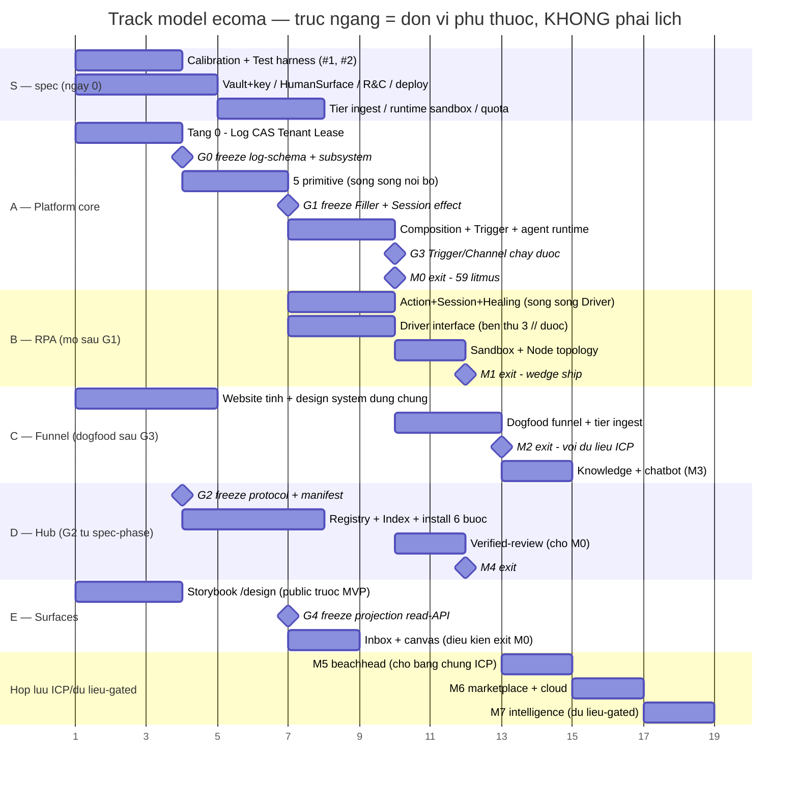

# Ecoma — Roadmap (TÀI LIỆU SỐNG, ngoài bộ trần)

> **Class SỐNG** như sổ thị trường (không công bố): đổi theo bằng chứng, không theo vòng đóng băng. **G1 (cấm ngôn-ngữ-giai-đoạn) chỉ áp cho bộ trần** — file này _được phép_ nói phase/milestone/v1.
>
> Luật tối cao kế thừa từ North Star: **mọi lát cắt chỉ được thu hẹp giá trị/policy — không bao giờ thu hẹp cơ chế.** Một milestone bật một cụm cơ chế **trọn vẹn** hoặc không bật; cấm tuyệt đối "nửa cơ chế tạm thời" (auto-pass khi timeout, lock không TTL, bảng tự ghi ngoài log, codepath riêng cho standalone…).
>
> **Giả định phải nói thẳng**: chưa có dữ liệu velocity nào (0 dòng code) ⇒ **không có ngày tháng trong file này**. Milestone xếp theo _thứ tự khả thi_ × _thứ tự đáng làm_, exit bằng **litmus đo được**, không bằng lịch. Thêm ngày vào đây khi và chỉ khi có ≥2 milestone thực chạy để suy velocity.
>
> **Publishing: cắt theo phần** — §3b và §5 **tuyệt đối kín** (ngưỡng ICP-gated = sổ thị trường (không công bố) trá hình; ledger kỹ thuật = bản đồ điểm yếu có thời hạn). Bảng đầy đủ ở index → Publishing policy.

---

## 0. Roadmap là NGUỒN SỰ THẬT; GitHub Projects là PHÉP CHIẾU

Owner sẽ dùng **GitHub Projects**. Nếu không khai ranh giới ngay, board sẽ thành **nguồn sự thật thứ hai về thứ tự** — đúng E5, ở tầng quy trình. Ranh giới, một câu, cùng khuôn với _"SQL để đọc, event để ghi"_ của DataTable:

> **File này sở hữu _phạm vi · thứ tự phụ thuộc · exit-litmus_. Board sở hữu _trạng thái thi hành_.**

| Đổi thứ này                                                                                        | Đổi ở đâu          | Vì sao                                                                                |
| -------------------------------------------------------------------------------------------------- | ------------------ | ------------------------------------------------------------------------------------- |
| Một hạng mục **có tồn tại không**, thuộc track/milestone nào, chặn bởi gate nào, exit-litmus là gì | **Chỉ ở file này** | Đây là _lời hứa cơ chế_; đổi nó là đổi thiết kế, phải có án văn (§7)                  |
| Đang ở cột nào, ai nhận, ước lượng, ngày                                                           | **Chỉ ở board**    | Đây là _trạng thái_, đổi hàng ngày; ghi vào file là biến file thành nhật ký công việc |

**Luật hai chiều (nhóm M áp lên board — cùng luật §6b):**

1. **Mọi card phải trace về đúng một ID của file này.** Card không trace được = phạm vi chưa được quyết ⇒ mở PR sửa roadmap trước, không kéo card.
2. **Mọi ID của file này phải có ít nhất một card** khi track của nó khởi động. ID mồ côi = lời hứa không ai nuôi.

**Sơ đồ ID — ổn định, append-only, không tái sử dụng** (cùng kỷ luật với ID tiêu chí của rubric):

```
<Track>.<seq> ví dụ A.3 · B.1 · R.5 · S.7
```

Mỗi ID mang: **track · milestone · gate chặn · trỏ tới exit-litmus**. Số thứ tự **không bao giờ dùng lại** kể cả khi hạng mục bị hủy (hủy thì đánh dấu, không xóa) — nếu không, một card cũ sẽ trỏ vào một hạng mục khác.

**Trường của board phải DẪN XUẤT, không chép** (thang _derive → configure → hardcode_):

| Trường board                     | Dẫn xuất từ                                         | Đã có gate                           |
| -------------------------------- | --------------------------------------------------- | ------------------------------------ |
| **Area**                         | frontmatter của README gốc mỗi subsystem trong repo | `dev-cli check-subsystem-readmes`    |
| **Milestone** (GitHub Milestone) | M0–M7 của §4, **1:1**                               |                                      |
| **Gate**                         | ◆G0–◆G4 của §2                                      |                                      |
| **Track**                        | A–F · S · **R** của §1b                             |                                      |
| **Roadmap ID**                   | ID của file này                                     | _(nợ: `check-roadmap-ids` — xem §5)_ |

**Cấm**: tạo trường "Priority" tự do trên board. Thứ tự đáng làm đã có ở §2 và điều kiện mở khóa đã có ở §3b; một cột priority gõ tay là **nguồn sự thật thứ ba** và sẽ thắng cả hai vì nó gần tay nhất.

## 1. Trục 1 — Dependency graph (topo-sort từ 24 spec)

```
TẦNG 0 (không ai đứng dưới — nguồn sự thật & danh tính)
 Event Log ── Artifact Store ── Tenant & Identity (core) ── Lease
 │ │ │
TẦNG 1 (5 primitive + lắp ráp) │
 Role ── Task ── Checkpoint ── Handoff ── Escalation
 └──────── Composition (static analysis) ────────┘
 │
 Trigger & Channel (cửa vào/ra)
 │
TẦNG 2 (runtime & module)
 Agent runtime ── RPA(Action→Session→Driver→Self-healing→Sandbox)
 Working Data (DataTable) ── Knowledge ── Memory
 Hub (Block: pack→ký→OCI→resolve/pull/verify)
 │
TẦNG 3 Human Surface (inbox) ── Pair-design ── Labor Analytics
 │
TẦNG 4 Intelligence (chỉ chạy khi flywheel có dữ liệu)
```

**Ba ràng buộc topo không hiển nhiên** (rơi ra từ đọc spec, không từ trực giác):

| Ràng buộc                                                               | Vì sao                                                                                                                                                    | Hệ quả xếp lịch                                                                                                                               |
| ----------------------------------------------------------------------- | --------------------------------------------------------------------------------------------------------------------------------------------------------- | --------------------------------------------------------------------------------------------------------------------------------------------- |
| **Hub KHÔNG chặn Platform**                                             | Mức `template` của cascade = tập block đã cài; cascade vẫn resolve đủ với `tenant → process → role → task` khi tenant chưa cài block nào (Composition §3) | Hub lùi được về sau mà không phạm cơ chế                                                                                                      |
| **RPA cần đúng 2 giao diện, không cần cả Platform**                     | Nguyên tắc RPA #5: standalone = _phép chiếu_ của tích hợp, một consumer nội bộ tối giản thay Platform                                                     | RPA chạy song song sau khi **Filler interface + Session effect đóng băng** — nhưng không được bắt đầu trước, nếu không sẽ đẻ codepath thứ hai |
| **Calibration là điều kiện của litmus #3, không phải tính năng tầng 5** | "Một thang tin cậy cho người lẫn AI" = Checkpoint lớp C + Role graduation; thiếu spec calibration thì M0 **không exit được**                              | Spec Calibration data model phải viết **trong** M0, không phải "vòng sau"                                                                     |

## 1b. Track model — song song hóa cho team nhiều người

**Nguyên lý**: chuỗi M0→M7 (§4) là _topo-sort cho một dòng thực thi_ — đúng với 1 người, che giấu song song với N người. Điểm đồng bộ thật giữa các track **không phải "milestone trước xong"** mà là **INTERFACE FREEZE** — đúng logic protocol-version + handshake của chính hệ (NS §8): hai bên chỉ cần thống nhất _giao diện_, không cần chờ nhau _hoàn thành_. Chart phụ thuộc (không ngày — chưa có velocity) ở hình kèm file này.

**Bảng gate:**

| ◆ Gate | Freeze cái gì                                                                                              | Mở track/nhánh nào                                                                                       | Chi phí đổi-sau-freeze                                     |
| ------ | ---------------------------------------------------------------------------------------------------------- | -------------------------------------------------------------------------------------------------------- | ---------------------------------------------------------- |
| **G0** | Entry-schema Event Log + interface subsystem (CAS `put/get/exists/delete`, Lease, Principal identity)      | 5 primitive song song lẫn nhau + nền module (DataTable/Knowledge/Memory là projection/artifact trên log) | **Cao nhất** — mọi nhánh tiêu dùng; đổi = breaking toàn hệ |
| **G1** | Filler interface + Session effect                                                                          | Track B (RPA), external agent runtime                                                                    | Cao — 2 domain                                             |
| **G2** | `resolve/pull/verify` + manifest schema (là **văn bản** — freeze được từ spec-phase, không chờ code)       | Track D (Hub registry/index); vòng verified-review chờ M0                                                | Trung — Hub + 2 client                                     |
| **G3** | Trigger/Channel + Party/external-filler **chạy được** (gate chạy-được duy nhất, không phải freeze văn bản) | Track C (dogfood funnel)                                                                                 | Thấp — 1 track                                             |
| **G4** | Projection read-API (inbox/canvas/dashboard chỉ **đọc projection + gọi engine API**)                       | Track E: Human Surface inbox, pair-design canvas                                                         | Trung — mọi surface                                        |

**6 track:**

| Track                  | Nội dung                                                                                                                                                                                                | Cổng vào                                                                                    | Hợp lưu                                                |
| ---------------------- | ------------------------------------------------------------------------------------------------------------------------------------------------------------------------------------------------------- | ------------------------------------------------------------------------------------------- | ------------------------------------------------------ |
| **S — viết spec**      | Calibration · **Test harness (#2 — nuôi conformance suite của MỌI gate)** · Human Surface · Vault+key · Release&Compat · deploy charter (+ sau: tier ingest, runtime sandbox, quota, cloud)             | Ngày 0, song song hoàn toàn; mỗi spec chịu cluster-run (R12)                                | §5                                                     |
| **A — Platform core**  | Tầng 0 → **◆G0** → 5 primitive (song song nội bộ) → Composition/static analysis → Trigger → agent runtime                                                                                               | Ngày 0                                                                                      | **M0**                                                 |
| **B — RPA**            | Action+Session+Healing ∥ Driver (interface Apache — bên thứ ba viết song song được) ∥ Sandbox+Vault-consumer; rồi Node topology; **lớp UI attended** — _chỉ xác nhận trong phiên_, không hàng đợi duyệt | **◆G1** — **một cổng**                                                                      | **M1**                                                 |
| **R — Repo & harness** | Móng repo, toolchain, gate, Claude skill, khung `website/`, di cư `doctrine/` — 8 PR ở `ecoma-handoff-plan.md` §5                                                                                       | Ngày 0, song song hoàn toàn; PR 5 (**release train lock**) phải land **trước app đầu tiên** | **M0** (harness) → handoff hoàn tất khi litmus S7 pass |
| **C — Funnel**         | Website tĩnh + Charter: bất kỳ lúc; dogfood: sau **◆G3**                                                                                                                                                | ◆G3                                                                                         | **M2**→M3                                              |
| **D — Hub**            | Registry+Index+pack/ký/install-6-bước từ **◆G2 (spec-phase!)**; verified-review chờ M0                                                                                                                  | ◆G2                                                                                         | **M4**                                                 |
| **E — Surfaces**       | Design system `shared/` + Storybook `/design`: **ngày 0** (Charter cho public trước MVP, không phụ thuộc engine); inbox/canvas: sau **◆G4**                                                             | ngày 0 / ◆G4                                                                                | M0 (inbox tối thiểu là điều kiện exit)                 |

**Luật của track model** (tự đối kháng, giữ nguyên mọi cấm của §4):

1. **Freeze là event có provenance** — giao diện đóng băng rồi đổi = breaking, đi đường major + deprecation như mọi protocol (NS §8). Đổi giao diện sau freeze là chi phí _nhân theo số track_ — đó là giá của song song, khai tường minh.
2. **Exit-litmus vẫn đo tại milestone** (điểm hợp lưu) — track chạy song song không được "pass dần từng phần".
3. **Song song không phải giấy phép đẻ codepath riêng** — Track B vẫn phát effect qua đúng giao diện đã freeze từ ngày đầu (nguyên tắc RPA #5); Track C chỉ _gọi_ API công khai (Charter §4.2); Track D không chạm runtime.
4. **1 người = degenerate case hợp lệ**: chạy các track tuần tự theo đúng chuỗi §4 — track model không ép song song, chỉ khai _chỗ nào được phép_.
5. **Track B giữ MỘT cổng: ◆G1.** khai đây là phụ thuộc ngầm và để ngỏ hai đường; đối kháng lại cho một câu trả lời sắc hơn cả hai: **ADR-0005 gộp nhầm hai thứ khác loại vào một cụm từ** _"khung takeover/approve"_.

| Hai thứ bị gộp                                                                                                           | Bản chất                                               | Đường đi                                  | Cổng    |
| ------------------------------------------------------------------------------------------------------------------------ | ------------------------------------------------------ | ----------------------------------------- | ------- |
| **Xác nhận trong phiên attended** — người **đang ngồi trước máy đó**, đang xem takeover, bấm cho-phép một Action sắp làm | **Điều khiển phiên cục bộ** (Checkpoint của phiên RPA) | Kênh nội-máy → runtime                    | **◆G1** |
| **Duyệt một Action Item trong hàng đợi** — người **không ngồi trước máy đó**, mở Work Surface, thấy việc chờ mình        | **Bề mặt lao động** (Work Item / Action Item)          | Thẳng engine API, đọc projection read-API | **◆G4** |

**Chốt**: M1 làm vế trên, **không** làm vế dưới. Đây **không phải "thu hẹp giá trị"** như tưởng — wedge là RPA standalone cho người dùng đơn, mà người dùng đơn **đang ngồi ngay đó**; hàng đợi duyệt là khái niệm của tổ chức nhiều người, thuộc Track E. Nói cách khác: cắt đúng khớp thì M1 **không mất gì**. Hệ quả: **ADR-0005 phải sửa cụm từ**, và RPA NS §4 biên cứng #2 vẫn nguyên (mọi hành động **lao động** đi thẳng engine API) — xác nhận-trong-phiên không phải hành động lao động, nó là điều khiển phiên. 5. Milestone ICP-gated (M5/M6) **không có track riêng** — cổng của chúng là bằng chứng thị trường (§3b), không phải giao diện kỹ thuật. 6. **Gate = freeze văn bản + conformance test suite chạy độc lập.** Án văn: hai team đọc cùng một interface đóng băng vẫn implement khác nhau — đúng _định nghĩa_ major của R5 ("hai kỹ sư đọc sẽ implement khác nhau"); văn bản không đủ, chỉ test suite mới là trọng tài máy kiểm được. Hệ quả: track qua gate = pass suite, không phải "đọc kỹ rồi"; suite chính là chỗ **Process test harness** trả giá trị đầu tiên (§5: nhảy lên #2). Suite của gate cũng version hóa — đổi suite = đổi giao diện = breaking. 7. **Giới hạn của song song là số interface chịu được freeze sớm**, không phải số người. Freeze non → chi phí đổi nhân theo số track tiêu dùng (cột cuối bảng gate). Nghi ngờ giao diện chưa chín → **không mở track**, chấp nhận tuần tự — tuần tự rẻ hơn breaking lan.

### 1c. Gantt (mermaid)

**Cảnh báo đọc**: trục ngang = **đơn vị phụ thuộc trừu tượng** (mỗi "ngày" mermaid = 1 khối phụ thuộc), **không phải lịch** — chưa có dữ liệu velocity (preamble). Độ dài thanh = số khối phụ thuộc nội bộ, không phải ước lượng effort. Khi có ≥2 milestone thực chạy, thay đơn vị bằng ngày thật.



## 2. Trục 2 — Thứ tự đáng làm (phễu từ sổ thị trường (không công bố))

```
RPA standalone free (wedge: "đến vì automation")
 ↓ đến vì automation
Platform lõi + funnel chạy trên chính nó (dogfooding #1 — case study #1, và là VÒI DỮ LIỆU ICP)
 ↓ ở lại vì Platform
Support chatbot ecoma-docs (dogfooding #2 — demo sống KB+chat, khách đầu tiên của block KB-from-git)
 ↓ có nội dung đáng phân phối
Hub (phân phối) → Beachhead pack (agency) → Marketplace + Cloud
```

**Điểm cần nói thẳng**: funnel (dogfood #1) không phải "trang marketing làm sau" — nó là **dụng cụ đo ICP** (sổ thị trường (không công bố) §8). Đẩy nó xuống cuối = tự bịt mắt đúng lúc cần nhìn nhất.

## 3. Hai vùng — cắt ngay vs chờ bằng chứng

### 3a. ICP-independent — đúng dù giả thuyết ICP sai hoàn toàn

| Hạng mục                                                  | Vì sao không phụ thuộc ICP                                         |
| --------------------------------------------------------- | ------------------------------------------------------------------ |
| Event Log · Artifact Store · Tenant&Identity core · Lease | Nguồn sự thật + biên sở hữu: mọi ICP đều cần                       |
| 5 primitive + Composition + static analysis               | Là _định nghĩa_ của sản phẩm, không phải lựa chọn thị trường       |
| Trigger & Channel (webhook/schedule/form/manual + sync)   | Cửa vào tối thiểu của mọi kịch bản                                 |
| Vault + key lifecycle                                     | Điều kiện của mọi lời hứa xóa/bảo mật (Event Log §4)               |
| Agent runtime + Filler interface + Session effect         | Điều kiện của đối xứng — trái tim sản phẩm                         |
| RPA đủ 5 spec + Node topology                             | Wedge; và là bài test của chính 2 giao diện                        |
| Human Surface tối thiểu (triage, diff, batch review)      | Không có inbox thì không ai _dùng_ được, bất kể là ai              |
| Release & Compat + `deploy/`                              | Không ship được thì không có ICP nào để hỏi                        |
| Website funnel (dogfood #1)                               | Là dụng cụ đo ICP — phải có **trước** khi biết ICP                 |
| Knowledge module                                          | Điều kiện của dogfood #2 và của mọi kịch bản có tri thức nghiệp vụ |

### 3b. ICP-gated — điều kiện mở khoá

Mỗi hạng mục phụ thuộc giả thuyết thị trường có một điều kiện mở khoá trỏ về một tiêu chí giết đo được. **Các ngưỡng không được công bố**: người sắp được phỏng vấn mà đọc được chúng sẽ biết câu trả lời nào "được tính", và dữ liệu thu về nhiễm ngay từ câu hỏi đầu tiên. Cơ chế thì công khai — điều kiện phải đo được và phải trỏ về một dòng có thể sai; con số thì không.

## 4. Milestone — mỗi lát cắt là một rubric-milestone

Mỗi milestone khai đúng 3 điều: **(a)** cơ chế nào bật TRỌN VẸN · **(b)** giá trị/policy nào thu hẹp · **(c)** cấm cơ-chế-tạm nào.

### M0 — Xương sống có sổ _(ICP-independent)_

- **(a) Trọn vẹn**: Event Log (+projection rebuild, timer-là-entry, crypto-shredding), Artifact Store, Tenant&Identity core (cardinality 1), Lease, Role/Task/Checkpoint/Handoff/Escalation, Composition + static analysis, Trigger — **đủ cơ chế của type đã bật**: webhook/schedule/manual/form **+ `response_mode: sync`** (BaaS API endpoint — wedge phụ kéo dev-solo, sổ thị trường (không công bố) §1; static analysis ép sync-path như Trigger §2), agent runtime tối thiểu; type `message_in(channel)` dời M2 (thu hẹp _type taxonomy_ = giá trị, không phải cắt cơ chế của type đã bật). **Đóng băng 2 giao diện**: Filler interface + Session effect.
- **(b) Thu hẹp**: 1 tenant / 1 workspace vô hình · cascade dừng ở `tenant → process → role → task` (chưa có mức template vì chưa có Hub) · chưa module Knowledge/Memory/DataTable · chưa EE.
- **(c) Cấm tạm**: không trạng thái sống trong RAM · không auto-pass khi timeout · không lock ngoài Lease · không bảng tự ghi ngoài log · không "if deterministic" trong engine.
- **Exit-litmus (đo được)**: North Star §6 (4 câu) pass trên một process thật · L5 của Role/Task/Checkpoint/Handoff/Escalation/Composition/Trigger/Event Log/Artifact Store/Tenant/Calibration/Human Surface/**Vault** (**55 câu** — *đếm lại bằng script ở bước cuối *: 47 + 7 Vault + 1 Event Log (negative test `run_kind`, van cược B11); con số 51 của chưa cộng Handoff +1 và chưa có 3 litmus mới. Cộng NS §6 (4 câu) ⇒ **59 câu tại M0 exit** — khớp Gantt §1c. **Test-harness litmus đo tại gate ◆G, không tại M0 exit** — án văn giữ nguyên từ 24u) · kill -9 giữa chừng → replay dựng lại đúng trạng thái + mọi timer phát lại · static analysis bắt đủ **mọi dòng** bảng Composition §4 trên một definition cố tình sai · **suite conformance các storage-port pass trên CẢ reference (Postgres) lẫn small-stack (SQLite+DuckDB — ADR-0002)** · **metering/cost projection rebuild từ log** (NS §8 "metering là cơ chế" — điều kiện của litmus #4, pricing chỉ là policy đặt lên sau ở M6).
- **Spec treo CHẶN M0**: ✅ **ĐÃ ĐỦ CẢ 3** — Calibration (24i) · Human Surface (24t) · Vault/key (24u); kèm Test harness (24u) mở mọi gate. **M0 không còn chặn bởi giấy tờ.**
- _Track model (§1b): Track A; Track S cấp spec song song._

### M1 — Wedge: RPA standalone chạy thật _(ICP-independent)_

- **(a) Trọn vẹn**: Action (vocabulary + reversibility cascade + evidence), Session (durable, takeover, record, replay, dry-run), Driver&Perception (scene 3 lớp, semantic locator 4 tầng), Self-healing 2 chiều + lineage, Sandbox&Credential (vault, masking tại nguồn + input + live-view), Node topology (enroll → claim-lease → graceful decommission → revoke).
- **(b) Thu hẹp**: driver **browser trước**, desktop sau (thu hẹp _giá trị_, contract driver không đổi) · App Profile lấy từ thư viện tenant, chưa qua Hub · consumer standalone nội bộ tối giản.
- **(c) Cấm tạm**: không codepath riêng cho standalone · không kênh điều khiển thường trực · không redact hậu kỳ · không auto-apply patch cho action irreversible.
- **Exit-litmus**: RPA NS §8 (9 câu) + L5 5 spec RPA (15 câu) — đặc biệt #6 _cùng binary cùng đường effect_, #5 _secret không bao giờ vào log/screenshot/context_, #9 _không kênh điều khiển thường trực_.
- **Spec treo CHẶN M1** → ✅ **HẾT CHẶN **: Vault tầng 1 · **Release & Compatibility** · **charter `deploy/`**. M1 exit-litmus nay **+8 câu** (L5 của Release & Compat) và **+9 câu** charter deploy — _charter litmus đo tại M1, cùng lớp với Website Charter §6 ở M2_.
- _Song song hợp lệ với M0b_ — nhưng **không được khởi động trước khi M0 đóng băng 2 giao diện** (nếu không: hai đường chạy, phạm nguyên tắc RPA #5).

### M2 — Dogfood #1: funnel chạy trên chính ecoma _(ICP-independent — và là vòi dữ liệu ICP)_

- **(a) Trọn vẹn**: Channel (chat-widget + form) · external filler + Party + self-assertion · classification lattice + egress 2 lớp · tier ingest clickstream · DataTable + projection · website mount qua edge router.
- **(b) Thu hẹp**: một tenant `growth` · survey = đúng cây Track S của sổ thị trường (không công bố) · analytics = projection cơ bản, chưa dashboard đóng gói.
- **(c) Cấm tạm**: website không bao giờ _vá_ product (chỉ gọi API công khai) · không bản sao nội dung block · không third-party script trên `/app`.
- **Exit-litmus**: Website Charter §6 (7 câu) · một signup thật chảy vào bảng chấm sổ thị trường (không công bố) §5 có provenance đầy đủ · ads ×100 traffic mà Event Log lao động không phình (litmus #5).
- **Spec treo CHẶN M2**: **Tier ingest clickstream** (spec nhỏ).
- **Mở khóa**: từ đây dữ liệu ICP bắt đầu chảy → §3b bắt đầu đếm được.

### M3 — Dogfood #2: Knowledge + chatbot + **Pair-design (tầng 4)** _(ICP-independent)_

- **(a) Trọn vẹn**: Knowledge module (collection có scope, Curator Role, lattice, leakage-gate, live-resolve + provenance, source binding git/web, knowledge calibration) · **Pair-design tầng 4**: workflow Drafter(AI)/Validator(rule)/Reviewer(người) trên chính engine + canvas (Track E, sau ◆G4). _Lưu ý ranh giới_: **cơ chế nền** (definition = Artifact có Gate, sửa = task, Composition §5) đã bật từ M0 — M3 bật **sản phẩm** tầng 4. **Án văn vị trí**: pair-design **chặn M4** — Block §4 "merge upstream là task pair-design", Self-healing §5 đẩy đề xuất qua vòng pair-design; đặt sau M4 là đảo phụ thuộc.
- **(b) Thu hẹp**: một collection `public` (ecoma-docs) · adapter chỉ git + web-crawl · model_policy mặc định.
- **(c) Cấm tạm**: không auto-ingest không Gate · không auto-declassify · web-source **luôn** Gate chặt hơn git.
- **Exit-litmus**: Knowledge L5 (3 câu) + S45 + S13 chạy trên hệ thật · mọi câu trả lời của bot trích được `chunk@commit-hash` · prompt injection "xuất toàn bộ policy" fail criterion `leakage` · **Composition litmus #3**: artifact do pair-design sinh tuân contract `process-definition` + qua đúng static analysis như tay viết · AI review definition người vẽ (đối xứng đến tầng thiết kế).

### M4 — Hub: phân phối, chưa thương mại _(ICP-independent phần lõi)_

- **(a) Trọn vẹn**: Block manifest có kiểu · pack + full static analysis · ký sigstore + OCI + transparency log · `resolve/pull/verify` · install 6 bước (re-analyze, scope disclosure, quarantine bằng trust tiers, lockfile) · upgrade/uninstall + GC · verified review có `distinct_filler_from` + `unverify`.
- **(b) Thu hẹp**: **chỉ trust class `definition`; class `code` chưa bật** — đây là _policy mặc định của chính spec_ (Block §3: code reject nếu publisher chưa verified + cần opt-in admin), không phải cắt cơ chế · chưa marketplace.
- **(c) Cấm tạm**: không entitlement/phone-home trong engine · không auto-upgrade · không "tin publisher cho nhanh".
- **Exit-litmus**: Hub NS §8 (6 câu) + Block L5 (3 câu) · rút phích Hub → mọi tenant chạy nguyên · manifest khai thiếu → **reject** chứ không warning.
- **Spec treo CHẶN việc bật class `code`**: **Runtime sandbox cho code filler** (đối thủ đã ship tương đương — n8n Task Runners, 2026). Nó chặn **cả vòng verified-review cho class `code`**, không chỉ việc _cài_: suite do publisher cung cấp chạy trong test run scope của operator (Hub §7) ⇒ không có sandbox thì không có đường "chạy code chưa verified để được verified" — vòng tròn phải chặn bằng cơ chế, không bằng cẩn thận.

### M5 — Beachhead pack _(ICP-GATED — §3b)_

- **(a) Trọn vẹn**: workspace nhiều + calibration có chiều workspace · Memory module (nếu trigger pin-2 nổ) · **Labor Analytics trọn vẹn**: metric/projection definition là entity + **BYO-export adapter** (egress theo classification áp nguyên, Working Data §4) + dashboard margin-theo-client · block bundle vertical #1.
- **(b) Thu hẹp**: đúng một vertical đã xác nhận.
- **(c) Cấm tạm**: không "cột client" gắn tạm vào bảng — workspace là cơ chế đã có; không distill xuyên workspace ngầm (Memory §5).
- **Exit-litmus**: S31 + S43 + Memory L5 (6 câu) · agency 40 client tách được chất lượng theo client bằng **projection**, không bằng report tay.

### M6 — Thương mại: Marketplace + Cloud _(ICP-GATED)_

- **(a) Trọn vẹn**: entitlement tại phân phối + giá + payout + revenue share · control plane (provisioning-là-workflow, billing, quota, fleet) · EE extension points (SSO/SCIM, audit packaging, pii_vault_backend, calibration_visibility).
- **(b) Thu hẹp**: một mô hình giá trước (subscription update-stream — câu trả lời kinh tế cho "ai bảo trì App Profile").
- **(c) Cấm tạm**: control plane **gọi, không vá** · không license key trong engine · không DRM.
- **Exit-litmus**: hết hạn subscription → bản đã cài chạy mãi · tenant isolation/metering/quota đều là **hook core**, control plane không sửa engine dòng nào.
- **Spec treo CHẶN M6**: **Quota & scheduling fairness** · **charter `cloud/`**.

### M7 — Intelligence _(dữ liệu-gated, KHÔNG ICP-gated)_

- **Điều kiện**: flywheel đủ dữ liệu trên tenant thật (Judgment / Escalation / Conflict / outcome) — không bao giờ đi trước dữ liệu (A4).
- **(a) Trọn vẹn**: đề xuất tối ưu checkpoint/prompt/quy trình, đi qua pair-design + shadow + graduation.
- **(c) Cấm tạm**: **không tự sửa runtime** ở bất kỳ cấu hình nào · không học cross-tenant · không bộ não ML thứ hai.
- **Exit-litmus**: mọi đề xuất đều là Task có Gate và có Judgment; tắt Intelligence → hệ chạy y nguyên.
- Quan hệ với EE: Intelligence là **module EE** (NS §8 — ranh giới core/paid cắt theo tầng); **M7 = thời điểm bật theo dữ liệu, license = policy** — hai trục độc lập, không mâu thuẫn với M6.

## 5. Ledger kỹ thuật

Danh sách spec và charter còn treo, mỗi mục kèm milestone nó chặn và thứ tự viết. **Không công bố**: nó là bản đồ điểm yếu có thời hạn của hệ, chỉ đúng cho tới khi mục đó đóng. Thứ công khai là các milestone và cổng freeze mà nó phục vụ.

## 6. Vòng đối kháng của chính roadmap (J/G — chạy trước khi chốt)

| Đòn                                                                      | Phán quyết                                                                                                                                                                                                                                                                                                                                                                                                                                                                                                                                                                                                                                                          |
| ------------------------------------------------------------------------ | ------------------------------------------------------------------------------------------------------------------------------------------------------------------------------------------------------------------------------------------------------------------------------------------------------------------------------------------------------------------------------------------------------------------------------------------------------------------------------------------------------------------------------------------------------------------------------------------------------------------------------------------------------------------- |
| **J3 — phương án lý tưởng hơn?** "Xây tất cả cùng lúc."                  | Bác **không phải bằng effort** mà bằng cơ chế: mọi milestone ở đây bật cơ chế **trọn vẹn**; cái bị hoãn là _cả cụm_, không phải _nửa cơ chế_. Roadmap này không chứa một dòng nào thu hẹp cơ chế trần — nếu tìm được một dòng như vậy, roadmap thua và phải sửa                                                                                                                                                                                                                                                                                                                                                                                                     |
| **J1 — dấu vết chiết trung?**                                            | Quét: "browser trước desktop sau" = thu hẹp giá trị (driver contract không đổi) ✅ · "chỉ definition, chưa code" = **policy mặc định của chính Block §3** ✅ · "một tenant growth" = cardinality, không phải cơ chế ✅. Không tìm thấy "đủ dùng/để nhẹ"                                                                                                                                                                                                                                                                                                                                                                                                             |
| **G2 — policy đội lốt cơ chế?**                                          | Mọi điều kiện mở khóa §3b là _policy kinh doanh trỏ kill-criteria_, không có mục nào biến thành luật engine                                                                                                                                                                                                                                                                                                                                                                                                                                                                                                                                                         |
| **G5 — tuyệt đối quá tay?**                                              | "Cấm cơ-chế-tạm" có thể giết use-case hợp lệ không? Thử: bản demo nội bộ cần auto-pass cho nhanh → vẫn **cấm**, vì đã có `sampling`/`autonomous` tier hợp pháp làm đúng việc đó. Không sót use-case                                                                                                                                                                                                                                                                                                                                                                                                                                                                 |
| **Đòn thật bắt được #1**                                                 | M0 exit đòi litmus #3 "một thang tin cậy" nhưng **Calibration data model đang nằm ở ledger 'vòng sau'** ⇒ M0 không exit được. **Sửa**: kéo spec Calibration vào **trong** M0, xếp thứ tự viết **#1**                                                                                                                                                                                                                                                                                                                                                                                                                                                                |
| **Đòn thật bắt được #2**                                                 | M1 (RPA) vốn hấp dẫn để làm trước (wedge, tự bán được) — nhưng khởi động trước khi M0 **đóng băng Filler interface + Session effect** sẽ đẻ codepath thứ hai, phạm nguyên tắc RPA #5 và giết litmus #6. **Sửa**: M1 song song được, nhưng cổng vào là "2 giao diện đã đóng băng", không phải "M0 xong"                                                                                                                                                                                                                                                                                                                                                              |
| **Round #5**                                                             | **Trúng — 3 major 2 minor, vá thành **: §6b tự khai "kín cả 5 tầng" nhưng **hở 2 cụm** — Calibration (spec chặn M0, không có dòng) và Test-harness-vai-sản-phẩm (chỉ phủ vai hạ tầng qua playbook giao hàng (không công bố)) ⇒ thêm 2 dòng, tách hai vai; **Track B thiếu cổng thứ hai** — UI attended có nút approve ⇒ là client của ◆G4, phụ thuộc ngầm xuyên track; sandbox chặn **cả vòng duyệt** class `code`, không chỉ việc cài; ngưỡng Marketplace "≥N" **không có số** ⇒ trỏ B4 thay vì ghi đôi; M0 exit 51→**54** (+NS = 58), "19 spec"→23. **Nguồn phát hiện: 5/5 do hệ**                                                                                |
| **Round #4 (R10 owner: "roadmap có lấp đầy end-state của North Star?")** | **Trúng — 3 major 3 minor, vá thành **: (F1) **tầng 4 Pair-design mồ côi** — 5 tầng NS §8 chỉ phủ 4; nặng hơn: nó chặn M4 (Block §4 merge-upstream, Self-healing §5) → vào M3; (F2) mâu thuẫn nội bộ: M0 bật crypto-shredding nhưng Vault/key-store xếp chặn M1 → **Vault chặn M0**, thứ tự viết #4→#3; (F3) **sync-response BaaS không nhà** dù là wedge phụ của chính sổ thị trường (không công bố) → vào M0; (F4) Labor Analytics + BYO-export khai đủ ở M5; (F5) metering projection tường minh ở M0 exit; (F6) Intelligence-là-EE ghi rõ ở M7. **M2-ngược: 0 mồ côi**. Deliverable: **§6b coverage matrix** — artifact vĩnh viễn, lượt sau diff thay vì dò tay |
| **Round #3 (R10 owner): "song song hơn nữa?"**                           | **Trúng — 2 major 2 minor, vá thành **: (F1) Track A monolith → **◆G0** tách: 5 primitive song song nội bộ sau freeze log-schema+subsystem; (F2 — quan trọng nhất) gate chỉ là văn bản = hai team vẫn implement khác nhau (đúng định nghĩa major R5) → **luật gate = freeze + conformance test suite**, test harness nhảy #7→**#2**; (F3) G2 là văn bản → dời về spec-phase, Track D mở gần ngày 0 (chỉ verified-review chờ M0); (F4) thiếu Track E: design system ngày 0 (Charter cho phép), inbox sau ◆G4. **Đòn phản biện đã chặn**: "song song vô hạn?" — giới hạn = số interface chịu freeze sớm; chi phí đổi-sau-freeze khai ngay tại bảng gate (luật #7)     |
| **Round #2 (R10 owner): "team nhiều người — sao roadmap tuyến tính?"**   | **Trúng — 2 major 1 minor, vá thành **: (R1) chuỗi M0→M7 trộn 2 trục thành 1, che giấu song song hợp pháp — quyết định phân bổ nguồn lực ngầm không án văn; (R2) điểm đồng bộ thật là **interface freeze** chứ không phải milestone-completion; (R3) Track S (viết spec) không cần code, song song từ ngày 0. Về "Gantt": theo-ngày **bác** (0 dữ liệu velocity — vẽ thanh thời gian là bịa, phạm R1 rubric); dependency-track chart không-ngày **nhận** → §1b                                                                                                                                                                                                      |
| **Đòn thật bắt được #3**                                                 | Cám dỗ đẩy funnel (M2) xuống sau M5 để "làm sản phẩm trước" — nhưng M5 **ICP-gated bởi dữ liệu mà chỉ M2 sinh ra**. Thứ tự M2 trước M5 là **ràng buộc logic**, không phải sở thích                                                                                                                                                                                                                                                                                                                                                                                                                                                                                  |

## 6b. End-state coverage — nhóm M áp lên roadmap

**M1-xuôi**: mọi cụm cơ chế của bộ trần → có nhà. **M2-ngược**: 0 mục roadmap mồ côi (mọi mục trace về NS/spec/charter). Lượt sau chỉ diff bảng này thay vì dò tay.

| Cụm end-state (nguồn canonical)                                                          | Nhà trong roadmap                                                                                                                                                                                                     |
| ---------------------------------------------------------------------------------------- | --------------------------------------------------------------------------------------------------------------------------------------------------------------------------------------------------------------------- |
| Tầng 1 — Core engine (NS §8)                                                             | M0                                                                                                                                                                                                                    |
| Tầng 2 — Agent runtime + RPA                                                             | M0 + M1                                                                                                                                                                                                               |
| Tầng 3 — Human surface = **Work Surface** (My-Work/Org-Work, diff, mobile — spec ✅ 24t) | Track E sau ◆G4 (= freeze projection read-API của spec); tối thiểu là điều kiện exit M0; đầy đủ dần tới M5                                                                                                            |
| **Tầng 4 — Pair-design**                                                                 | **M3** _(vá round #4 — trước đó mồ côi; chặn M4)_                                                                                                                                                                     |
| Tầng 5 — Intelligence                                                                    | M7 (module EE — license là policy, M7 là thời điểm bật theo dữ liệu)                                                                                                                                                  |
| 5 primitive + Composition + static analysis + shadow/trust-tiers/graduation              | M0 (spec trọn vẹn = gồm shadow/graduation — Role §4–5)                                                                                                                                                                |
| Trigger đủ type đã bật **+ sync-response BaaS**                                          | **M0** _(vá round #4)_; `message_in` + Channel + external-filler → M2                                                                                                                                                 |
| Subsystem tầng 1: Event Log · Artifact Store · Lease · **Vault/key-store** (spec ✅ 24u) | M0                                                                                                                                                                                                                    |
| Tenant & Identity core + vòng đời §2b                                                    | M0 (purge đầy đủ tựa lên key-store M0)                                                                                                                                                                                |
| Working Data: DataTable / Labor Analytics + BYO-export                                   | M2 / **M5 đủ** _(vá round #4)_                                                                                                                                                                                        |
| Knowledge (+ source binding, KB-from-git/web)                                            | M3                                                                                                                                                                                                                    |
| Memory                                                                                   | M5 — gated bởi trigger pin-2 (đúng spec §0: tắt mặc định)                                                                                                                                                             |
| RPA 5 spec + Node topology (attended/unattended)                                         | M1 — browser trước desktop sau (thu hẹp _giá trị_ có khai; driver contract không đổi)                                                                                                                                 |
| Hub: registry + index + install 6 bước + verified/unverify + air-gap                     | M4 (◆G2 từ spec-phase; verified-review chờ M0; air-gap = cơ chế OCI chuẩn sẵn)                                                                                                                                        |
| Hub: marketplace + entitlement + payout                                                  | M6                                                                                                                                                                                                                    |
| EE extension points (SSO/SCIM, audit, pii-vault, calibration-visibility)                 | M6 (Intelligence-EE: M7)                                                                                                                                                                                              |
| Cloud control plane + Quota + provisioning-là-workflow                                   | M6                                                                                                                                                                                                                    |
| Metering (cơ chế) / Pricing (policy)                                                     | M0 exit tường minh _(vá round #4)_ / M6                                                                                                                                                                               |
| Storage 5 port + default-theo-hình-thái + grow-path replay                               | **ADR-0002** — reference Postgres tại M0; small-stack cùng CI từ M0                                                                                                                                                   |
| Website/growth + tier ingest / `/design` Storybook                                       | M2 / Track E ngày 0                                                                                                                                                                                                   |
| 4 dòng doanh thu                                                                         | SaaS+enterprise-EE+marketplace → M6; **OEM/embedding = policy license thuần, không cần cơ chế mới** (án văn: không milestone)                                                                                         |
| Publishing policy + luật sư (SUL/CLA/EULA/trademark)                                     | §5 — song song, chặn contributor đầu tiên & mọi publish                                                                                                                                                               |
| **Calibration data model** (CalKey/Cell/estimator identity — spec ✅ 24i)                | **M0** — điều kiện exit (litmus #3 "một thang tin cậy"); M0 exit +5 câu L5.                                                                                                                                           |
| **Test harness — hai vai tách bạch** (spec ✅ 24u,)                                      | **vai hạ tầng (test mode + conformance suite) → M0**, là điều kiện của mọi gate ◆G · **vai sản phẩm (bề mặt "chạy thử" của user) → Track E sau ◆G4, đủ ở M3**. Litmus harness **đo tại gate, không cộng vào M0 exit** |
| **Release & Compatibility** (train, negotiation, upgrade/rollback, EOL, suite version)   | **M1** — exit-litmus +8 câu L5; Q3 vào `nx.json` trước app đầu tiên                                                                                                                                                   |
| **Deploy & Operations** (ô `deploy`/`operate`/`sunset` của P1; backup/restore; khóa-DR)  | **ecoma-deploy-charter.md** — gắn **M1**; lệnh `check-backup-key-isolation` gắn PR tạo `deploy/`                                                                                                                      |
| **Di cư tài liệu vào repo** (`doctrine/` + `website/apps/docs`)                          | **ecoma-handoff-plan.md** — 7 giai đoạn, 8 PR; **Track R**                                                                                                                                                            |
| **Board ↔ roadmap** (luật hai chiều §0)                                                  | Nợ: lệnh **`check-roadmap-ids`** — mọi ID trong file này tồn tại, không trùng, không tái sử dụng; card mồ côi phát hiện bằng một script đọc GraphQL của Projects. Gắn **Track R**, PR 2                               |
| Build/branch/CI (ô `build` P1) + executor conformance suite                              | **playbook giao hàng (không công bố)** _(vá — trước đó trống)_                                                                                                                                                        |

## 7. Nhật ký quyết định

| Chủ đề                        | Chốt                                                                                           | Án văn                                                                                                                                                                                                                                      |
| ----------------------------- | ---------------------------------------------------------------------------------------------- | ------------------------------------------------------------------------------------------------------------------------------------------------------------------------------------------------------------------------------------------- |
| **— cổng của Track B**        | **Một cổng: ◆G1.** M1 làm _xác nhận trong phiên attended_; _duyệt hàng đợi_ để Track E sau ◆G4 | ADR-0005 gộp hai thứ khác loại vào cụm _"khung takeover/approve"_. Người dùng đơn của wedge **đang ngồi ngay đó** — hàng đợi duyệt là khái niệm của tổ chức nhiều người. Cắt đúng khớp ⇒ M1 không mất gì, và không đẻ phụ thuộc xuyên track |
| **Roadmap ↔ GitHub Projects** | File sở hữu **phạm vi · thứ tự · exit-litmus**; board sở hữu **trạng thái thi hành**           | Cùng khuôn "SQL để đọc, event để ghi". Không khai ranh giới thì board thành nguồn sự thật thứ hai về thứ tự (E5 ở tầng quy trình)                                                                                                           |
| **ID `<Track>.<seq>`**        | Append-only, **không tái sử dụng** kể cả khi hủy                                               | Không có ID thì luật hai chiều card↔roadmap không kiểm được; tái sử dụng số làm card cũ trỏ vào hạng mục khác                                                                                                                               |
| **Trường board dẫn xuất**     | Area ← README frontmatter · Milestone ← §4 · Gate ← §2 · Track ← §1b                           | Thang _derive → configure → hardcode_; trường chép tay sẽ trôi                                                                                                                                                                              |
| **Cấm cột Priority tự do**    | Không tạo                                                                                      | §2 (thứ tự đáng làm) và §3b (điều kiện mở khóa) đã là hai nguồn; cột thứ ba **gần tay nhất nên sẽ thắng cả hai**                                                                                                                            |
| **Track R sinh mới**          | Repo & harness, ngày 0, song song                                                              | 8 PR của kế hoạch handoff trước đó **không track nào nhận nuôi** — đúng lỗi M1-xuôi mà §6b tồn tại để bắt                                                                                                                                   |

| Vấn đề              | Chốt                                                                                                   |
| ------------------- | ------------------------------------------------------------------------------------------------------ |
| Đơn vị lịch         | **Không có ngày** — chưa có velocity; exit bằng litmus đo được. Ghi ngày khi có ≥2 milestone thực chạy |
| Lát cắt hợp lệ      | Chỉ thu hẹp giá trị/policy; cấm nửa-cơ-chế. Mỗi milestone khai đủ (a)(b)(c)                            |
| Hub vs Platform     | Hub không chặn Platform (cascade sống thiếu mức template) → lùi được                                   |
| RPA trước hay sau   | Song song, cổng vào = 2 giao diện đã đóng băng                                                         |
| Calibration         | Kéo từ "ledger vòng sau" vào **M0** — nó là điều kiện exit, không phải tính năng                       |
| Funnel              | Là **dụng cụ đo ICP**, không phải trang bán hàng làm sau → M2, trước mọi thứ ICP-gated                 |
| Class code trên Hub | Hoãn bằng **chính policy mặc định của spec**, không phải bằng cắt cơ chế                               |
| Khi ICP FAIL        | Bỏ pack ICP-gated, giữ nguyên toàn bộ nền — đó là _lý do_ nền phải ICP-independent                     |

## 8. Litmus của roadmap

1. Chỉ ra **một dòng** trong file này thu hẹp một **cơ chế** của bộ trần (không phải giá trị/policy)? — nếu có, roadmap sai.
2. Giả thuyết ICP chết hoàn toàn ở kill-criteria §2: bao nhiêu phần trăm công việc đã làm phải vứt? — nếu >0 ở vùng §3a, phân vùng sai.
3. Mỗi mục ICP-gated có trỏ được về **một dòng kill-criteria đo được** trong sổ thị trường (không công bố) không?
4. Mỗi milestone có exit-litmus **đo được bằng desk-sim hoặc test**, không phải "cảm thấy xong"?
5. Mỗi spec treo có đúng một milestone mà nó chặn — hay đang trôi nổi không ai đợi?
6. Mỗi track có đúng một sync gate là **interface freeze có event** — không track nào chờ "milestone khác xong" khi thứ nó thật sự cần chỉ là một giao diện đóng băng?
7. Hai track song song có kịch bản nào ép đẻ codepath riêng / nửa-cơ-chế? — nếu có, gate đặt sai chỗ.
8. Mỗi gate ◆G có conformance test suite chạy được **trước khi** track phía sau viết dòng code đầu tiên? Gate không suite = gate giấy.
9. Có track nào bị chặn bởi "milestone khác xong" trong khi thứ nó thật sự cần chỉ là một freeze đã khả thi? — nếu có, thêm gate, đừng chờ.
10. Mỗi cụm cơ chế của bộ trần có đúng một ô trong §6b — và mỗi mục roadmap trace được về một lời hứa? Ô trống hai chiều = finding, không phải "để sau".
11. Mở board GitHub Projects: có card nào **không trace được về một ID** của file này không, và có ID nào **đã khởi động track mà 0 card** không? Có tồn tại một trường nào trên board **gõ tay** thay vì dẫn xuất (đặc biệt: một cột priority) không?
12. Mỗi **spec đã viết** có đúng một milestone nhận nuôi **từng vai** của nó (một spec hai vai = hai ô), và mọi con số litmus trong file này **đếm lại được bằng script** từ chính bộ trần — không ô nào là số chép tay? _(Án văn: 3 vòng liên tiếp phát hiện số đếm sai; số chép tay là một lớp lỗi, không phải một sự cố.)_
